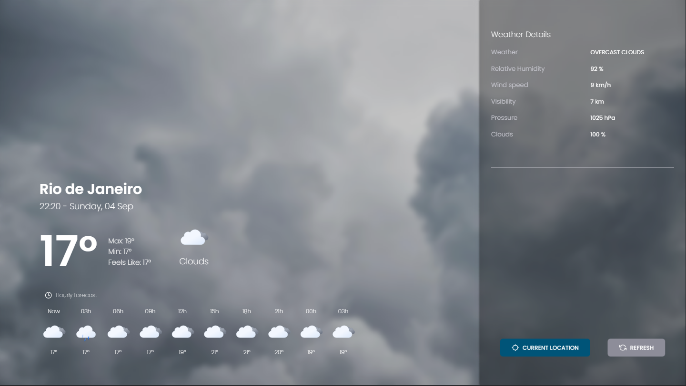
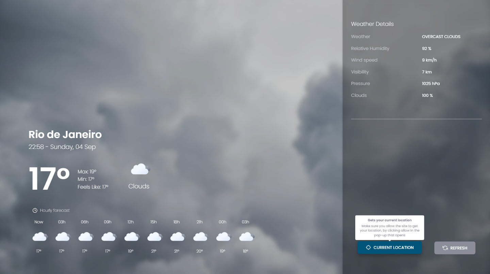
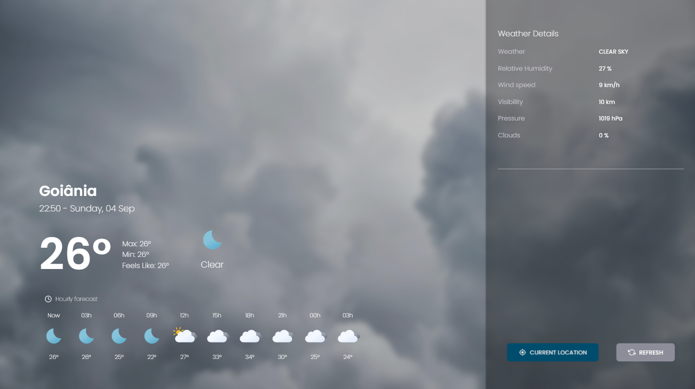
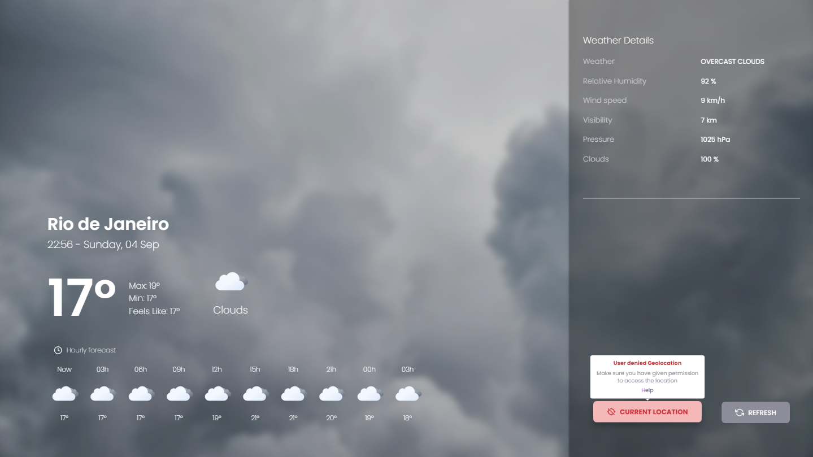

# Weather APP 🌤🌡

 <a href="#project">👉 Project</a>
 <a href="#technologies">👉 Technologies</a>
 <a href="#execution">👉 Execution</a>
 <a href="#more">👉 More Images</a>

<h2 id="project">:muscle: Project</h2>

This application gets the weather data from the user's location, if the user wants and agrees to share their location.

The data is obtained through the [Weather API](https://openweathermap.org/api), where passing latitude and longitude gets current, future and historical data.

<h2 id="technologies">:rocket: Used Technologies</h2>

This project was developed with the following technologies:

- [Node 16.17](https://nodejs.org/en/)
- [React 18.2](https://reactjs.org/)
- [TypeScript 4.6.4](https://www.typescriptlang.org/)
- [Vite](https://vitejs.dev/)
- [Radix-UI](https://www.radix-ui.com/)
- [React-Icons](https://react-icons.github.io/react-icons/)
- [Styled-Components](https://github.com/styled-components/styled-components)
- [Axios](https://github.com/axios/axios)
- [Jest](https://jestjs.io/)
- [ESLint](https://eslint.org/)

<h2 id="execution">👨🏻‍💻 Execution</h2>

To run the project:

- First we have to:
  - Clone the project by running this command in the terminal `git clone <repo_url>`;
  - Register at site [Weather API site](https://home.openweathermap.org/users/sign_up) to get the api key, as it is needed to get the climate data;
    - After registering, just go to [this address](https://home.openweathermap.org/api_keys) and copy the key already created by default;
  - Open the project folder and duplicate the .env.example file and rename the copy to .env;
    - Then, in the variable `VITE_API_KEY` put the key copied from the site;
- Open the project folder in the terminal and run:
  - `yarn` or `npm install` -> To install all dependencies;
  - `yarn dev` or `npm run dev` -> To run the project;
- To run the tests just run `yarn test` or `npm run test`.

<h2 id="more">🌆 More Images</h2>

  
  

    Default location, when the application is opened a default location already appears
 

  
  

    When the user allows access to the location
  

  
  

    When the user does not allow access to the location
  

